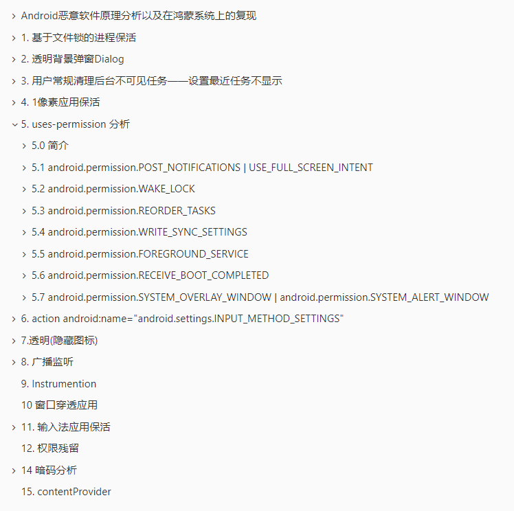

# 实习总结

* **50041400 崔博洋**

* **OpenHarmony部  北研终端**

## 0 实习概述

##### 实习时间

2024年6月26日报道，2024年8月28日离职。

##### 实习部门

OpenHarmony部五部安全小组

##### 实习导师

代超、李欣哲

##### 实习内容

主要是针对软件安全

* 恶意应用
  * 分析安卓上常见的恶意应用行为
  * 在android10.0上实现一些常见的恶意应用
  * 按照类似的思路在 HarmonyOS Next Beta（API 12）上验证这些恶意应用是否能实现
* 静态代码检测(软件分析)
  * 背景是 针对发布在应用市场的鸿蒙应用，需要进行安全检测，但是仅靠人力对应用进行测试分析工作量太大，因此使用静态程序分析的方法。
  * 静态程序分析的第一步即是处理输入，在HarmonyOS上，程序包是Hap包，Hap包有固定格式的
  * 因此实现了一个解析hap包中的.abc文件结构的java项目

下面将具体介绍实习内容和完成情况：

## 1. 恶意应用

实习内容如上面所列，下面重点介绍实习成果：

### 1.1 3个严重问题单 1个一般问题单

#### 3个严重问题单：

* 总的来说 三个单子对应三个方面的薄弱点进行攻击、构造恶意应用，但都衍生于一个问题：

  一个应用发布长时任务后即被认为是处于前台，即便返回主界面，此时应用仍然有拉起一个界面的权限

* **攻击1 对应单号 DTS2024081621336**

  * **漏洞分析：**

    应用发布长时任务后就被认为是处于前台，因此有了从后台拉起界面的权限

  * **对标安卓：**

    android开发文档中专门解释了对后台拉起界面的限制：https://developer.android.com/guide/components/activities/background-starts?hl=zh-cn

  * **代码实现：**

    在提单中有对应案例和演示视频

    * 步1：发布数据传输类型的长时任务
    * 步2：设置定时器，发送任意http请求并更新长时任务进度条(此步作用为绕过长时任务对伪造长时任务的管控)
    * 步3：设置定时器，循环拉起**当前应用界面**
    * 现象：从应用返回主界面后，从后台自己弹出一个应用界面

  * **修改建议：**

    按照android上对于后台启动的限制对一些典型场景进行限制。

    长时任务这种不易被感知的行为就不应该赋予启动界面的权限，这一点可以和画中画比较，画中画即便有一个极为明显的小窗视频在屏幕上方也无法拉起一个界面。

* **攻击2 对应单号 DTS2024081621133**

  * **漏洞分析：**

    应用通过以极快的速度拉起自己，能够达到通知栏无法下拉的效果

  * **对标安卓：**

    通知栏的优先级很高，不存在三方应用可以收起通知栏的场景

  * **代码实现：**

    在提单中有对应案例和演示视频

    * 步1：在应用启动时设置速度极快的定时器，不断地startAbility拉起自己的UIAbility
    * 现象：无法下拉通知栏

  * **修改建议：**

    从和开发人员的交流来看，通知栏开发人员认为存在三方应用启动收起通知栏的场景，并把收起通知栏的权限开放。只要在通知栏已经下拉的状态时有应用启动界面，即可触发收起通知栏。

    这是不合理的，

    * 首先当通知栏下拉后，用户就不会主动的启动一个应用，也就不会存在有应用要求有通知栏收起的动作。在安卓上能够触发通知栏收起动作的，全部是系统发出的，例如通知栏下拉状态有人打电话，此时电话接听界面会触发通知栏收起。
    * 其次，这不是仅仅解决攻击1中后台启动就能掩盖的问题，即便修复了攻击1中的漏洞，通知栏的也要做增强，即三方应用不管在通知栏蒙层下方进行何种动作，都不能覆盖通知栏蒙层。

* **攻击3 对应单号 DTS2024081621474**

  * 漏洞分析：

    此攻击要结合攻击1来看，通过发布伪造长时任务从而能够实现后台弹出界面，此时如果应用以UIAbility1去频繁启动UIAbility2，会出现多任务列表无法进入的情况

  * 对标安卓：

    安卓上应用启动自身的其他界面无法覆盖多任务列表

  * 代码实现：

    在提单中有对应案例和演示视频，该攻击和攻击1的区别即是 攻击1是启动自身@entry标记的UIAbility，攻击2是UIAbility1去启动UIAbility2

    * 步1：发布数据传输类型的长时任务
    * 步2：设置定时器，发送任意http请求并更新长时任务进度条(此步作用为绕过长时任务对伪造长时任务的管控)
    * 步3：在UIAbility1中设置定时器，循环使用startAbility起另一个UIAbility2
    * 现象：应用界面一直跳，且使用上滑手势也无法进入多任务列表

  * 修改建议：

    不管是何种启动应用，都不应该能覆盖多任务列表。鸿蒙设备上没有在设置-》应用管理中强制停止应用的选项，如果将多任务列表覆盖，将造成应用无法杀死的现象

#### 1个一般问题单：

* **攻击4 对应单号 DTS2024080911620**

  * 漏洞分析：

    当一个应用hap包被安装两次，两次设置不同的入口Ability和versionCode。

    其中修改VersionCode模拟应用升级操作，设置不同入口Ability达到伪造应用图标的目的。

    此时 应用在桌面展示的图标和在通知栏发布通知的图标不一致，而通知使用图标作为唯一标识(标题和内容均可伪造)，造成伪造通知的目的

  * 对标安卓：

    安卓中通知的标题无法更改，硬性设置为应用名称

  * 代码实现：

    在提单中已经详细阐述此处不在赘述

  * 修改建议：

    开发人员给出修改，从之前判断VersionName是否相同变为，不判断，直接重新设置图标，解决该问题。

### 1.2 20余种恶意行为的分析和实现

* 分析的内容包括

   

* 由于信息安全的原因，部分HarmonyOS上的实现只能在公司电脑实现，当前文件夹只有android上的实现

* 相关链接：

  [CBY11/MaliceAndroidApp (github.com)](https://github.com/CBY11/MaliceAndroidApp) 外部版本(只有android相关分析和实现)

  https://3ms.huawei.com/km/blogs/details/15743457 内部版本(有android和Harmony相关分析和实现)

## 2 .abc文件结构解析

* 相关链接

  [CBY11/GetFromAbc (github.com)](https://github.com/CBY11/GetFromAbc)

## 3. 个人总结

#### 收获：

* 经过两个月的实习对**恶意应用**有了极其深入的了解

* 了解了各种恶意行为以及**实现的方法和拦截的途径**

* 由于要实现一些恶意应用的实例，对**android开发和Harmony开发**有了极其深入的了解

  * 对**stage模型**有了深入了解，对应用层和各种系统服务如ams，bms，systemui，boardcast深入了解

  * 对android上的一些机制和HarmonyOS上的机制能够建立**对应关系**
  * 能够依照开发文档，快速开发鸿蒙应用
  * 发现了一些当前HarmonyOS相比于Android的缺陷，并了解了**DTS**系统
  * 在和开发人员讨论问题的过程中了解了不仅要发现问题，也要知道问题如何产生，如何给出修复意见

* 了解了**软件分析和软件逆向**

  * 了解了android逆向的常见框架如jdax，soot，tai-e
  * 初步了解了软件分析的第一步：解析文件结构

#### 展望：

* 当前对于**漏洞的挖掘**还是停留在应用层，从用户观感(UI)的角度出发去挖掘漏洞

  未来通过学习的深入，希望能够挖掘内核层面的漏洞，并从数据、隐私的角度去发掘

* 对于**软件逆向和静态程序分析**，这是一个高价值的行业，并且人才紧缺

  未来希望能够学习更多逆向技术和静态程序分析技术。

​	

